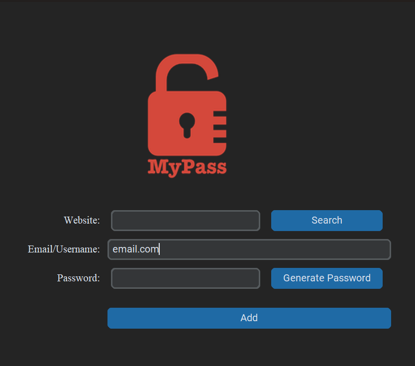

# 🔐 VaultKey — Local Password Manager

A clean, dark-themed desktop password manager built with Python and CustomTkinter. VaultKey lets you securely store, retrieve, and generate strong passwords — all saved locally on your machine as a JSON file.

---

## ✨ Features

- **Save credentials** — Store website, email/username, and password in one click
- **Search passwords** — Instantly look up saved credentials by website name
- **Password generator** — Auto-generates strong passwords (letters + symbols + numbers) and copies them to your clipboard
- **Local storage** — All data is saved in a `record.json` file on your machine; nothing leaves your device
- **Modern UI** — Built with CustomTkinter for a sleek dark-mode interface

---

## 📸 Preview

> 

---

## 🚀 Getting Started

### Prerequisites

- Python 3.10+
- `pip`

### Installation

1. **Clone the repository**
   ```bash
   git clone https://github.com/PatelKrish-07/Vault_key.git
   cd Vault_key
   ```

2. **Install dependencies**
   ```bash
   pip install -r requirements.txt
   ```

3. **Set up your environment**

   Create a `.env` file in the project root:
   ```
   MAIL=your_default_email@example.com
   ```
   This email will be pre-filled in the Email/Username field on startup.

4. **Add your logo**

   Place a `logo.png` file (200×200px recommended) in the project root.

5. **Run the app**
   ```bash
   python main.py
   ```

---

## 🗂️ Project Structure

```
vaultkey/
├── main.py           # Main application
├── logo.png          # App logo image
├── record.json       # Auto-created; stores your saved passwords
├── .env              # Your default email (not committed to git)
├── requirements.txt
└── README.md
```

---

## ⚙️ How It Works

| Action | Description |
|---|---|
| **Generate Password** | Creates a randomised password and auto-copies it to your clipboard |
| **Add** | Saves the current website + email + password entry to `record.json` |
| **Search** | Looks up a website in `record.json` and displays its stored credentials |

---

## 🔒 Security Notes

- Passwords are stored in **plain text** in `record.json`. This project is intended for local, personal use.
- Do **not** commit `record.json` or `.env` to version control. Add them to your `.gitignore`:
  ```
  .env
  record.json
  ```

---

## 📦 Dependencies

See [`requirements.txt`](requirements.txt) for the full list.

---


